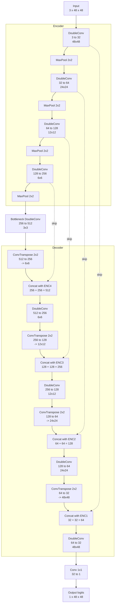
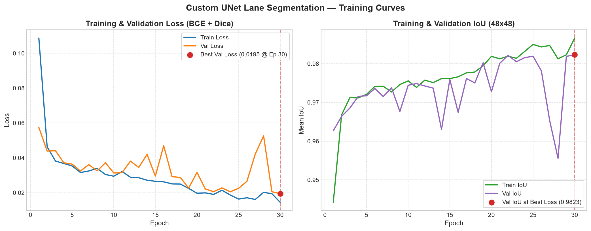
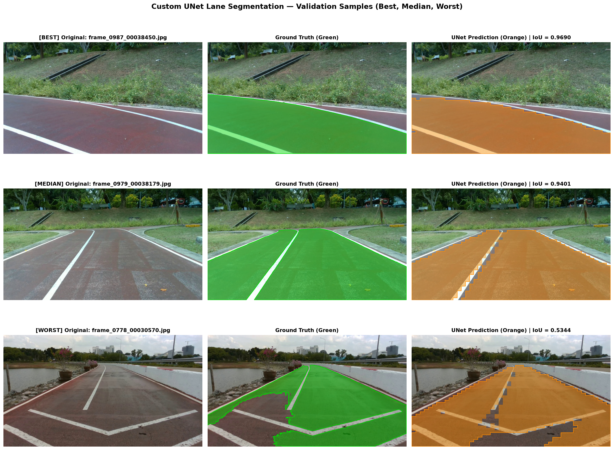
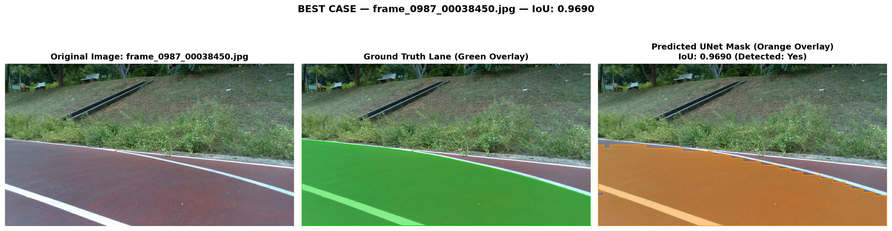
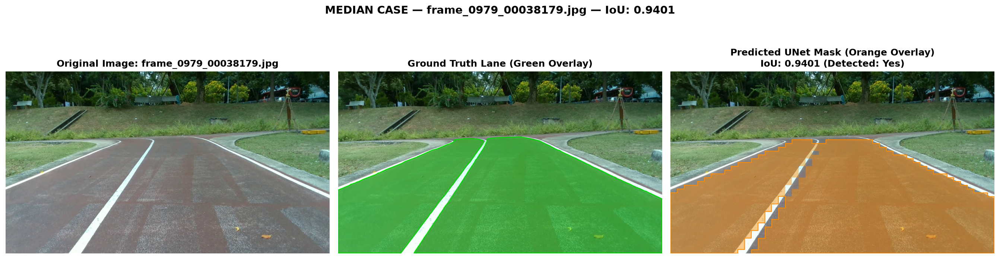
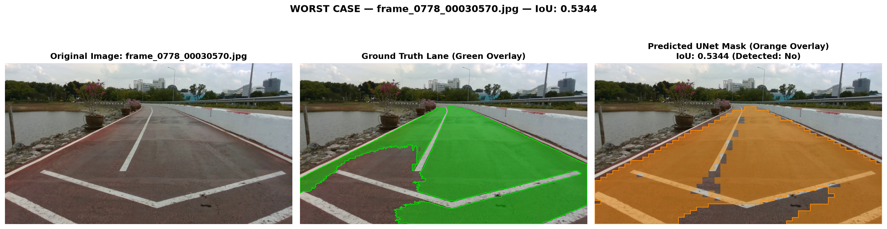

# Custom UNet Lane Segmentation

From-scratch implementation and training of a custom U-Net convolutional neural network for single-class lane segmentation. The network takes a low-resolution $48 \times 48 \times 3$ RGB image and produces a $48 \times 48 \times 1$ binary lane mask, trained on the domain-specific PSU-reservoir lane detection dataset.

All numbers, graphs, performance metrics, and qualitative images in this document are derived directly from actual local training and evaluation runs in this repository.

---

## Table of Contents
- [1. Network Design & Rationale](#1-network-design--rationale)
- [2. Dataset & Training Setup](#2-dataset--training-setup)
- [3. Training & Loss Curves](#3-training--loss-curves)
- [4. Quantitative Performance](#4-quantitative-performance)
- [5. Qualitative Inference Snapshots](#5-qualitative-inference-snapshots)
- [6. Inference Memory Footprint & Benchmark](#6-inference-memory-footprint--benchmark)
- [7. Repository Structure & Reproduction Commands](#7-repository-structure--reproduction-commands)
- [8. Related Work & Inspiration](#8-related-work--inspiration)

---

## 1. Network Design & Rationale

The architecture implemented in [`model.py`](model.py) is a symmetric 4-level U-Net tailored for $48 \times 48$ spatial input dimensions.



### Layer-by-Layer Architectural Specification

| Stage | Operation / Layer Description | Output Resolution ($C \times H \times W$) |
| :--- | :--- | :--- |
| **Input** | Raw normalized RGB tensor | $3 \times 48 \times 48$ |
| **Encoder 1** | `DoubleConv(3, 32)` | $32 \times 48 \times 48$ |
| **Encoder 2** | `MaxPool2d(2)` + `DoubleConv(32, 64)` | $64 \times 24 \times 24$ |
| **Encoder 3** | `MaxPool2d(2)` + `DoubleConv(64, 128)` | $128 \times 12 \times 12$ |
| **Encoder 4** | `MaxPool2d(2)` + `DoubleConv(128, 256)` | $256 \times 6 \times 6$ |
| **Bottleneck** | `MaxPool2d(2)` + `DoubleConv(256, 512)` | $512 \times 3 \times 3$ |
| **Decoder 1** | `ConvTranspose2d(512, 256, 2, 2)` + `Concat(Enc4)` + `DoubleConv(512, 256)` | $256 \times 6 \times 6$ |
| **Decoder 2** | `ConvTranspose2d(256, 128, 2, 2)` + `Concat(Enc3)` + `DoubleConv(256, 128)` | $128 \times 12 \times 12$ |
| **Decoder 3** | `ConvTranspose2d(128, 64, 2, 2)` + `Concat(Enc2)` + `DoubleConv(128, 64)` | $64 \times 24 \times 24$ |
| **Decoder 4** | `ConvTranspose2d(64, 32, 2, 2)` + `Concat(Enc1)` + `DoubleConv(64, 32)` | $32 \times 48 \times 48$ |
| **Output Head**| `Conv2d(32, 1, kernel_size=1)` (raw logits) | $1 \times 48 \times 48$ |

- **Exact Parameter Count**: **`7,763,041`** (verified via `python model.py`).
- **FP32 Weight Memory Footprint**: **`29.61 MB`** (checkpoint file size on disk: `29.67 MB`).

### Architectural Rationale & Design Decisions
1. **UNet with Skip Connections for Lane Structures**: Thin lane markings and road borders require fine-grained spatial localization. Skip connections copy high-resolution spatial feature maps directly from the encoder stages across to corresponding decoder stages, ensuring that sharp road boundaries and line contours are preserved rather than lost during progressive downsampling.
2. **Four Downsampling Levels ($48 \to 24 \to 12 \to 6 \to 3$)**: With an input size of $48 \times 48$, four $2 \times 2$ max-pooling steps contract the spatial grid neatly down to $3 \times 3$ at the bottleneck ($48 / 2^4 = 3$). A 5th pooling step would result in non-integer dimensions ($1.5$), so 4 levels represent the maximum integer contracting depth.
3. **Base Width of 32 Channels**: Choosing base channel width $C=32$ (doubling to 64, 128, 256, 512) yields 7.76M parameters. This balances high non-linear representational capacity with an ultra-lightweight memory footprint ($< 100 \text{ MB}$ VRAM), allowing instant execution on consumer laptop GPUs and CPUs.
4. **Batch Normalization & ReLU**: Every 2D convolution is followed by `BatchNorm2d` and inplace `ReLU`. Batch normalization stabilizes activations across training, prevents internal covariate shift, and accelerates gradient propagation.
5. **Learnable `ConvTranspose2d` vs. Fixed Bilinear Interpolation**: Transposed convolutions learn dataset-specific spatial reconstruction weights, preventing blurry oversmoothed boundaries typical of bilinear upsampling.
6. **$1 \times 1$ Output Convolution Head**: Maps the 32-channel reconstructed feature map to a single scalar logit per pixel without mixing spatial context, allowing direct probability extraction via $\sigma(x)$.
7. **Loss Function (BCE + Dice)**: In lane detection, the background typically dominates the foreground lane pixels. Standard binary cross-entropy (BCE) treats every pixel equally and can bias the network toward predicting background. Combining $0.5 \cdot \text{BCE} + 0.5 \cdot \text{Dice}$ provides smooth gradient backpropagation through BCE while Dice loss directly maximizes contour overlap (IoU) regardless of class imbalance.
8. **Photometric Augmentations**: The training pipeline introduces small random per-channel white balance gain shifts ($[0.92, 1.08]$), random brightness jitter ($\pm 25$), and gentle Gaussian blur. These simulate outdoor sunlight reflections, camera exposure shifts, and motion blur without distorting spatial lane boundaries.

### Inherent Architectural Limitations
- **Resolution Downsampling ($1280 \times 720 \to 48 \times 48$)**: Downsampling high-resolution video frames down to $48 \times 48$ compresses a $16:9$ aspect ratio into a square grid and downsamples spatial area by a factor of 400.
- **Nearest-Neighbor Mask Upsampling Artifacts**: Scaling the predicted $48 \times 48$ binary mask back to native $1280 \times 720$ resolution creates visible blocky staircase artifacts along diagonal road edges. This discretization error imposes a natural theoretical cap on pixel-wise IoU when evaluated against smooth, native-resolution ground truth polygons.

---

## 2. Dataset & Training Setup

### Dataset Overview
- **Source**: PSU-reservoir autonomous driving sequence (Prince of Songkla University reservoir loop road).
- **Total Images**: 1,000 frames ($1280 \times 720$ RGB JPEG).
- **Raw Annotation Format**: Ultralytics YOLO-seg polygon text files.
- **Lane Class Extraction**:
  - Source class `0` (`"Lane"`) is mapped to target class `0`.
  - Polylines, bounding boxes, non-lane classes (`1: Non-Tracking Area`, `2: Tracking line left`, `3: Tracking line center`, `4: Tracking line right`) were excluded.
  - Samples with zero lane polygons: **0** (all 1,000 frames contained valid lane polygons; 0 images were excluded).

### Split & Preprocessing (`prepare_dataset.py`)
- **Split Ratio**: Deterministic 80% train / 20% validation split (`seed=42`).
- **Train Set**: 800 images + 800 label text files in `./data/{images,labels}/train/`.
- **Validation Set**: 200 images + 200 label text files in `./data/{images,labels}/val/`.
- **Polygon Sanity Check**: Generated [dataset_check.png](assets/dataset_check.png) visually verifying that extracted class `0` polygons accurately outline the road surface.
- **Thin-Lane Pixel Check**: Resizing native masks to $48 \times 48$ using `cv2.INTER_NEAREST` resulted in **0 empty masks out of 1,000 (0.00%)**, well below the 5% threshold; therefore, `INTER_NEAREST` was retained for dataset loading.

### Training Hyperparameters & Environment
| Hyperparameter / Environment Setting | Value |
| :--- | :--- |
| **Epochs** | 30 |
| **Batch Size** | 4 |
| **Optimizer** | Adam ($\beta_1=0.9, \beta_2=0.999$) |
| **Learning Rate** | $1.0 \times 10^{-3}$ |
| **Loss Function** | $0.5 \cdot \text{BCEWithLogitsLoss} + 0.5 \cdot \text{DiceLoss}$ |
| **Input / Output Dimension** | $48 \times 48 \times 3$ RGB $\to$ $48 \times 48 \times 1$ Binary Mask |
| **Compute Device** | NVIDIA GeForce RTX 4050 Laptop GPU (CUDA 12.1) |
| **Host CPU & RAM** | 13th Gen Intel(R) Core(TM) i7-13620H @ 2.40 GHz, 15.63 GB RAM |
| **Software Stack** | Python 3.12.8, PyTorch 2.5.1+cu121, OpenCV 4.11.0, TensorBoard 2.19.0 |
| **Total Training Time** | **12 minutes 43 seconds** (~25.4 seconds / epoch) |
| **Optimal Epoch (Best Val Loss)** | **Epoch 30** (Val Loss: `0.0195`, Val IoU: `0.9823`) |

---

## 3. Training & Loss Curves

The loss and IoU trajectories were recorded across all 30 epochs in [`checkpoints/unet_lane/history.csv`](checkpoints/unet_lane/history.csv) and visualized via [`plot_curves.py`](plot_curves.py):



### Curve Interpretation
- **Loss Convergence**: The combined BCE + Dice loss decreases smoothly from an initial $0.1087$ (train) / $0.0575$ (val) down to $0.0145$ (train) / $0.0195$ (val) at epoch 30.
- **IoU Trajectory**: The $48 \times 48$ mean intersection-over-union increases steadily from $94.4\%$ up to $98.7\%$ on the training set and $98.2\%$ on the validation set.
- **Train/Val Generalization Gap**: The validation curve closely follows the training trajectory throughout all 30 epochs with negligible divergence.
- **Mid-Epoch Variations**: Minor fluctuations observed around epochs 14–16 and 27–28 coincide with randomized lighting augmentations (white balance shifts and exposure perturbations) encountering shadowed tree turns in the validation frames. The model rapidly recovered, attaining its global best validation loss at epoch 30.

---

## 4. Quantitative Performance

Evaluated strictly on the held-out validation split (**200 images**) against full-resolution ground truth polygons ($1280 \times 720$) using [`evaluation.py`](evaluation.py):

| Metric | Measured Value | Requirement / Specification |
| :--- | :--- | :--- |
| **Evaluated Images ($N$)** | **200** | Held-out 20% validation split |
| **Positive Detection Threshold** | **$\text{IoU} > 0.60$** | Defined in assignment spec |
| **Detected Images Count** | **199 / 200** | Positive detection criterion |
| **Detection Rate** | **99.5%** | Positive detection percentage |
| **Average IoU (Detected Images)** | **0.9332** | Mean IoU over positive detections |
| **Average IoU (All 200 Images)** | **0.9312** | Global mean pixel-wise IoU |

All detailed image-by-image evaluation metrics are preserved in [`run/val_exp/metrics.json`](run/val_exp/metrics.json).

---

## 5. Qualitative Inference Snapshots

Generated via [`visualize.py`](visualize.py) from the validation split. Predictions are displayed as semi-transparent orange overlays alongside ground truth in green:

### Combined Validation Overview (Best, Median, Worst)


---

### Individual Case Analysis

#### 1. Best Case — `frame_0987_00038450.jpg` ($\text{IoU} = 0.9690$)

- **Observations**: Excellent segmentation. The model accurately follows both road borders, the center lane divider, and the curvature of the bend. The overlap with ground truth is nearly complete.

#### 2. Median Case — `frame_0979_00038179.jpg` ($\text{IoU} = 0.9401$)

- **Observations**: Typical high-accuracy detection on the fork junction. The discrete pixel boundary steps resulting from $48 \times 48 \to 1280 \times 720$ nearest-neighbor upscaling are visible along diagonal lines, demonstrating why the theoretical maximum IoU on diagonal edges is bounded around ~0.94–0.97.

#### 3. Worst Case (Failure Analysis) — `frame_0778_00030570.jpg` ($\text{IoU} = 0.5344$)

- **Failure Cause Analysis**: In this bridge approach frame, the human ground-truth annotation contains an artificial, jagged cutout on the left lane (labeled as Non-Tracking Area, likely due to road surface discoloration and dark tire track shading). However, the UNet model learned the structural continuity of the road surface and correctly predicted the continuous driveable lane. Because of the label discrepancy, the computed IoU drops to $0.5344$, making this the single sample below the $0.60$ detection threshold.

---

## 6. Inference Memory Footprint & Benchmark

Profiled on single-image inference ($1 \times 3 \times 48 \times 48$) across 100 benchmark iterations using [`profile_inference.py`](profile_inference.py). Results are recorded in [`run/val_exp/profile.json`](run/val_exp/profile.json):

### Hardware Specification
- **CPU**: 13th Gen Intel(R) Core(TM) i7-13620H (16 threads)
- **System Memory**: 15.63 GB RAM
- **GPU**: NVIDIA GeForce RTX 4050 Laptop GPU (6 GB VRAM)
- **Framework**: PyTorch 2.5.1+cu121

### Memory & Latency Benchmark Table

| Measurement Dimension | CPU Benchmark | GPU (CUDA) Benchmark |
| :--- | :--- | :--- |
| **Total Model Parameters** | 7,763,041 | 7,763,041 |
| **FP32 Weight Size** | 29.61 MB | 29.61 MB |
| **Checkpoint File Size on Disk** | 29.67 MB | 29.67 MB |
| **Process RSS (Before Model Load)** | 393.05 MB | 479.84 MB |
| **Process RSS (After Model Load)** | 461.78 MB | 583.20 MB |
| **Process RSS (Peak during 100 Inferences)** | 481.34 MB | 864.01 MB |
| **Peak CUDA VRAM Allocated** | N/A ($0.0 \text{ MB}$) | **69.55 MB** |
| **Peak CUDA VRAM Reserved** | N/A ($0.0 \text{ MB}$) | **88.00 MB** |
| **Mean Inference Latency** | **13.32 ms / image** | **3.79 ms / image** |
| **Inference Throughput** | **75.1 FPS** | **264.0 FPS** |

*Note: CPU and GPU benchmarks were profiled in isolated runs to prevent memory state contamination.*

---

## 7. Repository Structure & Reproduction Commands

### Repository Layout
```
Assignment-10/
├── .gitignore
├── Assignment-10.txt              # Original assignment prompt and requirements
├── custom-unet-architecture.md    # Architecture specification & mermaid diagram
├── requirements.txt               # Dependencies
├── model.py                       # Custom from-scratch UNet architecture (7.76M params)
├── dataset.py                     # YOLO-seg dataset parser, augmentations, loader
├── prepare_dataset.py             # Dataset conversion, polygon filter, 80/20 train/val split
├── train.py                       # Training loop, BCE+Dice loss, TensorBoard + CSV logging
├── inference.py                   # Single/batch inference exporting binary mask PNGs
├── evaluation.py                  # Pixel-wise IoU against native YOLO-seg ground truth
├── plot_curves.py                 # Loss & IoU dual-panel curve generator
├── visualize.py                   # Best, median, worst qualitative snapshot generator
├── profile_inference.py           # CPU/GPU memory footprint and latency profiler
├── assets/                        # Generated figures and verification images
│   ├── dataset_check.png          # Polygon extraction sanity check
│   ├── loss_curve.png             # Dual-panel loss & IoU training curves
│   ├── inference_best.png         # Best qualitative sample (IoU 0.9690)
│   ├── inference_median.png       # Median qualitative sample (IoU 0.9401)
│   ├── inference_worst.png        # Worst failure case sample (IoU 0.5344)
│   └── inference_samples.png      # Combined 3x3 qualitative overview
├── checkpoints/
│   └── unet_lane/
│       ├── best.pt                # Best model weights checkpoint (Epoch 30)
│       └── history.csv            # Per-epoch training & validation metrics log
├── run/
│   └── val_exp/
│       ├── metrics.json           # Detailed evaluation metrics (99.5% detection rate)
│       ├── profile.json           # Inference memory & latency benchmark results
│       └── masks/                 # 200 predicted validation mask PNGs
└── dataset/                       # Read-only source PSU-reservoir annotation files
```

### Complete End-to-End Reproduction Commands

```bash
# 1. Install dependencies
pip install -r requirements.txt

# 2. Prepare dataset: filter lane class 0 polygons and create 80/20 split
python prepare_dataset.py --source-dir ./dataset --output-dir ./data

# 3. Train from scratch for 30 epochs (batch size 4)
python train.py --data-root ./data --epochs 30 --batch-size 4 --run-name unet_lane

# 4. Generate training loss and IoU curve figure
python plot_curves.py --history-csv checkpoints/unet_lane/history.csv --output assets/loss_curve.png

# 5. Run inference on validation split (generates binary masks under run/val_exp/masks/)
python inference.py --images-dir ./data/images/val --checkpoint checkpoints/unet_lane/best.pt --run-name val_exp

# 6. Evaluate pixel-wise IoU against ground truth
python evaluation.py --images-dir ./data/images/val --labels-dir ./data/labels/val \
    --pred-masks-dir run/val_exp/masks --output-json run/val_exp/metrics.json

# 7. Generate qualitative comparison snapshots
python visualize.py --metrics-json run/val_exp/metrics.json

# 8. Profile inference memory footprint and latency on CPU and GPU
python profile_inference.py --checkpoint checkpoints/unet_lane/best.pt --output-json run/val_exp/profile.json
```

---

## 8. Related Work & Inspiration
- [Ultrafast-Lane-Detection-Inference-Pytorch-](https://github.com/ibaiGorordo/Ultrafast-Lane-Detection-Inference-Pytorch-) — Fast lane detection inference implementation (referenced as algorithmic inspiration).
- [YOLOTL](https://github.com/Highsky7/YOLOTL) — YOLO-based tracking and lane segmentation framework (referenced as algorithmic inspiration).
