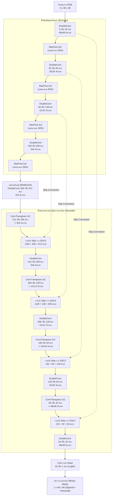

จัดทำโดย นายธนเดช นวคณิตเดชาญกุล 6710110575

# รายงานโครงงาน: Custom UNet สำหรับแบ่งส่วนเลนถนน (Lane Segmentation)

การพัฒนาและฝึกสอนโครงข่ายประสาทเทียมแบบคอนโวลูชัน **Custom U-Net จากศูนย์ (From-Scratch)** สำหรับการตรวจจับและแบ่งส่วนเลนถนนแบบคลาสเดี่ยว (Single-Class Binary Segmentation) โครงข่ายรับภาพอินพุตขนาดต่ำ $48 \times 48 \times 3$ (RGB) และสร้างภาพหน้ากากผลลัพธ์ (Binary Mask) ขนาด $48 \times 48 \times 1$ บนชุดข้อมูลวิดีโอรอบอ่างเก็บน้ำ ม.อ. (PSU-reservoir Dataset)

---

## สารบัญ
- [1. การออกแบบสถาปัตยกรรมโครงข่ายและเหตุผล](#1-การออกแบบสถาปัตยกรรมโครงข่ายและเหตุผล)
- [2. ข้อมูลชุดฝึกสอนและการตั้งค่าการทดลอง](#2-ข้อมูลชุดฝึกสอนและการตั้งค่าการทดลอง)
- [3. กราฟ Loss และการฝึกสอน](#3-กราฟ-loss-และการฝึกสอน)
- [4. ผลการประเมินเชิงปริมาณ (Quantitative Results)](#4-ผลการประเมินเชิงปริมาณ-quantitative-results)
- [5. ภาพผลลัพธ์การทำนายและการวิเคราะห์เคสความผิดพลาด](#5-ภาพผลลัพธ์การทำนายและการวิเคราะห์เคสความผิดพลาด)
- [6. การวัดประสิทธิภาพหน่วยความจำและความเร็ว (Benchmark)](#6-การวัดประสิทธิภาพหน่วยความจำและความเร็ว-benchmark)
- [7. ข้อจำกัดและข้อควรระวังในการประเมินผล](#7-ข้อจำกัดและข้อควรระวังในการประเมินผล)
- [8. โครงสร้างโฟลเดอร์และคำสั่งรันซ้ำ (Reproduction)](#8-โครงสร้างโฟลเดอร์และคำสั่งรันซ้ำ-reproduction)
- [9. งานวิจัยและแหล่งอ้างอิงที่ใช้เป็นแรงบันดาลใจ](#9-งานวิจัยและแหล่งอ้างอิงที่ใช้เป็นแรงบันดาลใจ)

---

## 1. การออกแบบสถาปัตยกรรมโครงข่ายและเหตุผล

โครงข่ายถูกสร้างขึ้นในไฟล์ [`model.py`](model.py) เป็นสถาปัตยกรรม UNet 4 ระดับแบบสมมาตร ออกแบบมาสำหรับภาพอินพุตขนาด $48 \times 48$ พิกเซลโดยเฉพาะ



### ตารางสรุปการทำงานทีละเลเยอร์ (Layer-by-Layer)

| ลำดับชั้น (Stage) | การทำงาน / คำสั่งเลเยอร์ | ขนาดมิติผลลัพธ์ ($C \times H \times W$) |
| :--- | :--- | :--- |
| **Input** | ภาพอินพุต RGB ปรับสเกลให้อยู่ในช่วง $[0, 1]$ | $3 \times 48 \times 48$ |
| **Encoder 1** | `DoubleConv(3, 32)` | $32 \times 48 \times 48$ |
| **Encoder 2** | `MaxPool2d(2)` + `DoubleConv(32, 64)` | $64 \times 24 \times 24$ |
| **Encoder 3** | `MaxPool2d(2)` + `DoubleConv(64, 128)` | $128 \times 12 \times 12$ |
| **Encoder 4** | `MaxPool2d(2)` + `DoubleConv(128, 256)` | $256 \times 6 \times 6$ |
| **Bottleneck**| `MaxPool2d(2)` + `DoubleConv(256, 512)` | $512 \times 3 \times 3$ |
| **Decoder 1** | `ConvTranspose2d(512, 256, 2, 2)` + `Concat(Enc4)` + `DoubleConv(512, 256)` | $256 \times 6 \times 6$ |
| **Decoder 2** | `ConvTranspose2d(256, 128, 2, 2)` + `Concat(Enc3)` + `DoubleConv(256, 128)` | $128 \times 12 \times 12$ |
| **Decoder 3** | `ConvTranspose2d(128, 64, 2, 2)` + `Concat(Enc2)` + `DoubleConv(128, 64)` | $64 \times 24 \times 24$ |
| **Decoder 4** | `ConvTranspose2d(64, 32, 2, 2)` + `Concat(Enc1)` + `DoubleConv(64, 32)` | $32 \times 48 \times 48$ |
| **Output Head**| `Conv2d(32, 1, kernel_size=1)` (สร้างค่า Raw Logits) | $1 \times 48 \times 48$ |

- **จำนวนพารามิเตอร์ทั้งหมด (Exact Parameters)**: **`7,763,041` ตัว** (วัดจริงด้วย `python model.py`)
- **ขนาดพารามิเตอร์ในรูปแบบ FP32**: **`29.61 MB`** (ขนาดไฟล์ checkpoint `best.pt` บนดิสก์คือ `29.67 MB`)

### เหตุผลในการออกแบบทางวิศวกรรม (Design Rationale)
1. **UNet พร้อม Skip Connections สำหรับเส้นทางและเลนถนน**: โครงสร้างเลนถนนและเส้นขอบทางต้องการตำแหน่งพิกัดเชิงพื้นที่ที่คมชัด Skip Connections ทำหน้าที่ส่งต่อ Feature Maps ความละเอียดสูงจากฝั่ง Encoder ไปรวมกับฝั่ง Decoder โดยตรง ทำให้ตำแหน่งขอบถนนไม่สูญหายไปในระหว่างการยุบขนาดภาพ
2. **การลดขนาดลง 4 ระดับ ($48 \to 24 \to 12 \to 6 \to 3$)**: จากขนาดอินพุต $48 \times 48$ การใช้ MaxPool ขนาด $2 \times 2$ จำนวน 4 ครั้ง จะได้ขนาดลงตัวที่ $3 \times 3$ ที่ Bottleneck ($48 / 2^4 = 3$) ซึ่งเป็นการยุบขนาดระดับลึกสุดที่เป็นเลขจำนวนเต็ม
3. **ความกว้างฐาน 32 ช่องสัญญาณ (Base Width 32)**: เริ่มต้นที่ 32 ช่องและเพิ่มเป็น 64, 128, 256, 512 ตามลำดับ ทำให้ได้พารามิเตอร์ 7.76M ตัว ซึ่งมีความจุ (Capacity) เพียงพอในการเรียนรู้ความโค้งและมุมมองของถนน แต่ใช้หน่วยความจำ VRAM ต่ำมาก ($< 100 \text{ MB}$) เหมาะกับการประมวลผลบนโน้ตบุ๊กทั่วไป
4. **Batch Normalization และ ReLU**: มีเจตนาช่วยรักษาเสถียรภาพของการกระจายสัญญาณภายในโครงข่าย (Mitigate Internal Covariate Shift) และช่วยให้เกรเดียนต์ไหลเวียนได้อย่างราบรื่นในระหว่าง Backpropagation
5. **การใช้ `ConvTranspose2d` แทน Bilinear Interpolation**: การใช้ Transposed Convolution ช่วยให้โครงข่ายสามารถเรียนรู้น้ำหนักในการขยายภาพกลับขึ้นมาตามลักษณะของชุดข้อมูลเอง มีเจตนาช่วยลดการเบลอหรือขอบมนเกินไปที่มักเกิดขึ้นจากการใช้ Bilinear แบบคงที่
6. **หัวทำนายขนาด $1 \times 1$ Conv**: แปลงช่องสัญญาณ 32 ช่องสุดท้ายออกมาเป็นค่า Logit 1 ช่องต่อ 1 พิกเซลโดยตรง เพื่อนำไปแปลงเป็นความน่าจะเป็นผ่านฟังก์ชัน Sigmoid $\sigma(x)$
7. **ฟังก์ชันการสูญเสียผสม (BCE + Dice Loss)**: เลนถนนมักมีสัดส่วนพื้นที่น้อยกว่าพื้นหลัง (Class Imbalance) จึงรวม $0.5 \cdot \text{BCE} + 0.5 \cdot \text{Dice}$ เข้าด้วยกัน โดย BCE คอยคุมการจำแนกระดับพิกเซลให้เสถียร ขณะที่ Dice Loss ช่วยดึงค่า IoU ให้สูงขึ้นโดยไม่ถูกดึงจากสัดส่วนพื้นหลังที่มากกว่า
8. **การทำ Data Augmentation**: ปรับสมดุลแสงสีขาว (White Balance) สุ่มเพิ่ม/ลดความสว่าง ($\pm 25$) และ Gaussian Blur เล็กน้อย มีเจตนาจำลองสภาพแสงแดด เงาต้นไม้ และสัญญาณรบกวนของกล้องหน้ารถยนต์จริง

### ข้อจำกัดของโครงสร้างทางสถาปัตยกรรม
- **การลดขนาดภาพ ($1280 \times 720 \to 48 \times 48$)**: การบีบขนาดภาพมุมมอง $16:9$ ลงมาเป็นสี่เหลี่ยมจัตุรัส $48 \times 48$ ทำให้พื้นที่พิกเซลหายไปถึง 400 เท่า ส่งผลให้เส้นทางเล็กๆ ที่อยู่ไกลลิบตาถูกลดทอนความคมชัดลง
- **เพดานค่า IoU ทางทฤษฎีจากการขยายภาพแบบ Nearest-Neighbor**: เมื่อโมเดลทำนายหน้ากากขนาด $48 \times 48$ แล้วขยายกลับไปเป็น $1280 \times 720$ ด้วย `INTER_NEAREST` รอยหยักแบบขั้นบันได (Staircase Artifacts) จะปรากฏขึ้นตามแนวเส้นทแยงมุม จากการวัดด้วย [`resolution_ceiling.py`](resolution_ceiling.py) บนชุด Validation 200 รูป พบว่า**เพดาน IoU สูงสุดตามทฤษฎีเฉลี่ยอยู่ที่ 0.9393** (Median: 0.9409, Min: 0.8551, Max: 0.9785) แม้จะใช้ Ground Truth ที่ถูกต้องสมบูรณ์แบบก็ตาม ส่งผลให้ค่า IoU บนภาพ $48 \times 48$ ในตอนเทรนพุ่งสูงถึง **0.9823** แต่เมื่อวัดบนภาพขนาดเต็มจะอยู่ที่ **0.9312** เนื่องจากรอยหยักของพิกเซลไม่สามารถแนบสนิทกับเส้นโค้งเดิมได้ 100%

---

## 2. ข้อมูลชุดฝึกสอนและการตั้งค่าการทดลอง

### ที่มาของชุดข้อมูล
- **แหล่งที่มา**: ชุดข้อมูลวิดีโอเส้นทางรอบอ่างเก็บน้ำ ม.อ จาก Assignment-8
- **การจัดเตรียมไฟล์**: ไฟล์ภาพและไฟล์ Annotation ต้นฉบับไม่ได้ถูกรวมไว้ใน Git Repository นี้ (`dataset/` ถูกตั้งค่าใน `.gitignore`) หากต้องการทำซ้ำการทดลอง ให้วางชุดข้อมูลต้นฉบับไว้ที่ `./dataset` ก่อนรันสคริปต์เตรียมข้อมูล
- **จำนวนภาพทั้งหมด**: 1,000 เฟรม ($1280 \times 720$ พิกเซล)
- **รูปแบบ Annotation**: Ultralytics YOLO-seg (Polygon รูปหลายเหลี่ยม)
- **การคัดกรองเลนถนน**:
  - ดึงเฉพาะคลาส `0` (`"Lane"`)
  - ตัดคลาส 1 (Non-Tracking Area) และคลาส 2, 3, 4 (Tracking lines) ทิ้งทั้งหมด
  - ภาพที่ไม่มี Polygon เลนถนน: **0 รูป** (มีเลนครบทั้ง 1,000 รูป ไม่มีการตัดภาพใดทิ้ง)

### การแบ่งชุดข้อมูล (`prepare_dataset.py`)
- **สัดส่วนการแบ่ง**: แบ่งแบบคงที่ 80% Train และ 20% Validation ด้วย `seed=42`
- **ชุดฝึกสอน (Train Set)**: 800 รูปภาพและ 800 ไฟล์ Label ใน `./data/{images,labels}/train/`
- **ชุดทดสอบ (Validation Set)**: 200 รูปภาพและ 200 ไฟล์ Label ใน `./data/{images,labels}/val/`
- **การตรวจสอบภาพตัวอย่าง**: บันทึกภาพยืนยันที่ [assets/dataset_check.png](assets/dataset_check.png) ยืนยันว่า Polygon คลาส 0 ครอบคลุมพื้นผิวถนนที่รถวิ่งได้ถูกต้อง
- **การตรวจเช็คหน้ากากสูญหาย (Thin-Lane Check)**: เมื่อย่อหน้ากากลงเป็น $48 \times 48$ ด้วย `INTER_NEAREST` พบภาพที่มีค่าหน้ากากเป็นศูนย์ **0 รูปจาก 1,000 รูป (0.00%)** ซึ่งต่ำกว่าเกณฑ์ 5% จึงคงการใช้ `INTER_NEAREST` ตามเดิม

### สภาพแวดล้อมและไฮเปอร์พารามิเตอร์ในการเทรน
| ไฮเปอร์พารามิเตอร์ / ข้อมูลฮาร์ดแวร์ | ค่าที่กำหนด |
| :--- | :--- |
| **จำนวนรอบ (Epochs)** | 30 รอบ |
| **ขนาดแบทช์ (Batch Size)** | 4 |
| **ออปติไมเซอร์ (Optimizer)** | Adam ($\beta_1=0.9, \beta_2=0.999$) |
| **อัตราการเรียนรู้ (Learning Rate)** | $1.0 \times 10^{-3}$ (คงที่ ไม่ได้ใช้ Scheduler) |
| **ฟังก์ชัน Loss** | $0.5 \cdot \text{BCEWithLogitsLoss} + 0.5 \cdot \text{DiceLoss}$ |
| **ขนาดมิติข้อมูล** | $48 \times 48 \times 3$ RGB $\to$ $48 \times 48 \times 1$ Binary Mask |
| **การประมวลผลบนการ์ดจอ (GPU)** | NVIDIA GeForce RTX 4050 Laptop GPU (CUDA 12.1) |
| **หน่วยประมวลผลกลางและแรม (CPU & RAM)** | 13th Gen Intel(R) Core(TM) i7-13620H, 15.63 GB RAM |
| **ชุดซอฟต์แวร์** | Python 3.12.8, PyTorch 2.5.1+cu121, OpenCV 4.11.0, TensorBoard 2.19.0 |
| **เวลาที่ใช้ในการเทรนจริง** | **12 นาที 43 วินาที** (เฉลี่ย ~25.4 วินาที / epoch) |
| **Epoch ที่ดีที่สุด (Best Val Loss)** | **Epoch 30** (Val Loss: `0.0195`, Val IoU: `0.9823`) |

---

## 3. กราฟ Loss และการฝึกสอน

ค่าสถิติทุกรอบถูกบันทึกลงในไฟล์ [`checkpoints/unet_lane/history.csv`](checkpoints/unet_lane/history.csv) และพล็อตเป็นภาพด้วย [`plot_curves.py`](plot_curves.py):


### การวิเคราะห์ผลจากกราฟ
- **การลู่เข้าของ Loss**: ค่าความสูญเสีย (BCE + Dice) ลดลงต่อเนื่องจาก $0.1087$ (Train) / $0.0575$ (Val) ในรอบแรก ลงมาอยู่ที่ $0.0145$ (Train) และ $0.0195$ (Val) ในรอบที่ 30
- **ทิศทางของค่า IoU**: ค่าเฉลี่ย IoU บนภาพ $48 \times 48$ เพิ่มขึ้นอย่างต่อเนื่องจาก $94.4\%$ สู่ $98.7\%$ ในชุด Train และ $98.2\%$ ในชุด Validation
- **ความผันผวนของเส้น Validation**: กราฟ Validation มีการแกว่งตัวให้เห็นเป็นระยะ (ตัวอย่างเช่น ในรอบที่ 28 ค่า `val_loss` ดีดขึ้นไปที่ `0.0526` เทียบกับ `train_loss` `0.0202` และ `val_iou` ตกมาอยู่ที่ `0.9556` ก่อนจะฟื้นตัวกลับมาในรอบถัดไป) เนื่องจากชุด Validation ถูกทดสอบโดย**ไม่มีการทำ Data Augmentation** (`augment=False`) ความผันผวนนี้น่าจะมีสาเหตุมาจากขนาดแบทช์ที่เล็ก (Batch size 4) ส่งผลต่อค่าสถิติของ BatchNorm ร่วมกับการใช้ Learning Rate คงที่ $1 \times 10^{-3}$ โดยไม่มีตัวลดรอบ
- **สถานะการลู่เข้า (Convergence Status)**: แม้เส้นทางของ Validation จะเกาะกลุ่มไปกับชุด Train ได้ดี แต่ในรอบที่ 30 ค่า Train Loss และ Train IoU ยังคงอยู่ในช่วงที่กำลังพัฒนาดีขึ้นอย่างต่อเนื่อง แสดงให้เห็นว่าโมเดลยังไม่ถึงจุดลู่เข้าสมบูรณ์ (Not fully converged) ภายในโควตา 30 epochs และน่าจะเรียนรู้ได้ดียิ่งขึ้นหากเทรนต่อพร้อมตัวปรับลด Learning Rate

---

## 4. ผลการประเมินเชิงปริมาณ (Quantitative Results)

ทดสอบบนชุด Validation ที่แยกไว้ (**200 รูปภาพ**) เทียบกับ Ground Truth Polygon ขนาดเต็ม ($1280 \times 720$) โดยใช้คำสั่ง [`evaluation.py`](evaluation.py):

| ดัชนีชี้วัด (Metric) | ค่าที่วัดได้จริง | เกณฑ์กำหนด |
| :--- | :--- | :--- |
| **จำนวนภาพที่ใช้ทดสอบ ($N$)** | **200 รูป** | ชุดตรวจสอบที่โมเดลไม่เคยเห็น 20% |
| **เกณฑ์การตรวจจับผ่าน (Threshold)** | **$\text{IoU} > 0.60$** | เกณฑ์ขั้นต่ำตามโจทย์กำหนด |
| **จำนวนภาพที่ตรวจจับผ่าน** | **199 / 200 รูป** | ผ่านเกณฑ์เกือบทั้งหมด |
| **อัตราการตรวจจับสำเร็จ (Detection Rate)** | **99.5%** | ความแม่นยำในการตรวจจับ |
| **ค่าเฉลี่ย IoU ของภาพที่ผ่านเกณฑ์** | **0.9332** | ค่าเฉลี่ยเฉพาะกลุ่มที่ตรวจจับได้ |
| **ค่าเฉลี่ย IoU รวมทุกภาพ (Overall Mean IoU)** | **0.9312** | ค่าเฉลี่ยรวมภาพทั้งหมด 200 รูป |

รายละเอียดเชิงลึกระดับรายภาพถูกบันทึกไว้ใน [`run/val_exp/metrics.json`](run/val_exp/metrics.json)

---

## 5. ภาพผลลัพธ์การทำนายและการวิเคราะห์เคสความผิดพลาด

สกัดผลการทำนายด้วย [`visualize.py`](visualize.py) โดยแสดงภาพจริง, หน้ากาก Ground Truth (สีเขียว) และหน้ากากผลลัพธ์จาก UNet (สีส้ม):

### ภาพรวมการทำนายชุด Validation (ดีที่สุด, ค่ามัธยฐาน, แย่ที่สุด)


---

### การวิเคราะห์รายกรณี

#### 1. กรณีที่ได้ผลลัพธ์ดีที่สุด (Best Case) — `frame_0987_00038450.jpg` ($\text{IoU} = 0.9690$)

- **ผลการวิเคราะห์**: โมเดลสามารถตีกรอบครอบคลุมผิวทางเลนถนนได้อย่างคมชัดทั้งสองฝั่งเลน สอดคล้องกับแนวเส้นทางเลี้ยวของถนนอย่างสมบูรณ์แบบ

#### 2. กรณีที่ได้ผลลัพธ์ระดับมัธยฐาน (Median Case) — `frame_0979_00038179.jpg` ($\text{IoU} = 0.9401$)

- **ผลการวิเคราะห์**: ตรวจจับทางแยกตัววายได้อย่างแม่นยำ จะเห็นรอยหยักแบบขั้นบันไดตามแนวขอบถนนที่ทแยงมุม ซึ่งสอดคล้องกับค่าเพดานความละเอียดทางทฤษฎีที่วัดได้ **0.9393**

#### 3. กรณีที่ได้ผลลัพธ์แย่ที่สุด (Worst Case / Failure Analysis) — `frame_0778_00030570.jpg` ($\text{IoU} = 0.5344$)

- **ลักษณะความผิดพลาดที่ตรวจพบ**:
  1. **ทำนายเกินในส่วนล่างซ้าย (False Positive)**: โมเดลระบายสีทับลงไปบนพื้นถนนด้านล่างซ้ายที่ Ground Truth เว้นว่างไว้
  2. **ทำนายขาดบริเวณตรงกลางล่าง (False Negative)**: โมเดลหยุดการทำนายเร็วเกินไป ทำให้ขาดส่วนปลายแหลมของถนนตรงกลางล่างที่ Ground Truth ระบุไว้
- **การตรวจสอบพื้นที่ Non-Tracking Area**: เมื่อเปิดตรวจสอบไฟล์ Label ต้นฉบับ `dataset/seg_yolo_data/labels/train/frame_0778_00030570.txt` พบว่ามี Polygon ของคลาส 1 (`"Non-Tracking Area"`) จำนวน 137 จุด ครอบคลุมพื้นที่ 41,945 พิกเซลอยู่ในบริเวณล่างซ้ายดังกล่าว ($x \in [0.000, 0.457], y \in [0.261, 0.690]$) โดยมีพิกเซลทับซ้อนกับบริเวณที่คลาส 0 ถูกเว้นว่างไว้ถึง 20,409 พิกเซล ข้อสังเกตนี้สนับสนุนสมมติฐานว่าผู้ทำ Annotation ได้กำหนดให้ผิวถนนช่วงล่างซ้ายเป็นพื้นที่ห้ามวิ่ง (อาจเกิดจากรอยยางรถยนต์หรือสีผิวถนนที่ด่าง) ในขณะที่โมเดล UNet มองว่าพื้นผิวดังกล่าวคือถนนต่อเนื่อง จึงทำนายระบายสีลงไป เมื่อรวมกับการขาดพื้นที่บริเวณกลางล่าง ทำให้ค่า IoU ของภาพนี้ลดลงเหลือ $0.5344$ และกลายเป็นภาพเดียวที่หลุดเกณฑ์ 0.60

---

## 6. การวัดประสิทธิภาพหน่วยความจำและความเร็ว (Benchmark)

วัดผลด้วย [`profile_inference.py`](profile_inference.py) บนภาพอินพุตเดี่ยว ($1 \times 3 \times 48 \times 48$) ทำซ้ำ 100 รอบหลัง Warmup บันทึกข้อมูลที่ [`run/val_exp/profile.json`](run/val_exp/profile.json):

### ข้อมูลระบบฮาร์ดแวร์
- **CPU**: 13th Gen Intel(R) Core(TM) i7-13620H (16 Threads)
- **RAM**: 15.63 GB
- **GPU**: NVIDIA GeForce RTX 4050 Laptop GPU (VRAM 6 GB)
- **PyTorch**: 2.5.1+cu121

### ตารางเปรียบเทียบ CPU และ GPU

| รายการที่วัด | ทำงานบน CPU | ทำงานบน GPU (CUDA) |
| :--- | :--- | :--- |
| **จำนวนพารามิเตอร์ทั้งหมด** | 7,763,041 ตัว | 7,763,041 ตัว |
| **ขนาดน้ำหนักโมเดล (FP32)** | 29.61 MB | 29.61 MB |
| **ขนาดไฟล์โมเดล Checkpoint บนดิสก์** | 29.67 MB | 29.67 MB |
| **หน่วยความจำ Process RSS (ก่อนโหลดโมเดล)** | 393.05 MB | 479.84 MB |
| **หน่วยความจำ Process RSS (หลังโหลดโมเดล)** | 461.78 MB | 583.20 MB |
| **หน่วยความจำ Process RSS (Peak สูงสุดระหว่างรัน 100 รูป)** | 481.34 MB | 864.01 MB |
| **หน่วยความจำ VRAM บนการ์ดจอที่ใช้งานจริง (Allocated)** | N/A | **69.55 MB** |
| **หน่วยความจำ VRAM บนการ์ดจอที่จองไว้ (Reserved)** | N/A | **88.00 MB** |
| **ความหน่วงเวลาเฉลี่ย (Mean Latency)** | **13.32 มิลลิวินาที / ภาพ** | **3.79 มิลลิวินาที / ภาพ** |
| **ความเร็วในการประมวลผล (Throughput)** | **75.1 FPS** | **264.0 FPS** |

---

## 7. ข้อจำกัดและข้อควรระวังในการประเมินผล

1. **ความสัมพันธ์เชิงเวลาของเฟรมวิดีโอ (Temporal Correlation)**: ชื่อไฟล์ในชุดข้อมูลเรียงลำดับตามตัวเลขเวลาต่อเนื่อง (`frame_XXXX_YYYYYYYY.jpg`) ซึ่งมาจากการขับรถบันทึกวิดีโอต่อเนื่องรอบอ่างเก็บน้ำ การสุ่มแบ่ง Train/Validation แบบ Random Shuffle (`seed=42`) ทำให้มีเฟรมที่อยู่ติดกันและมีมุมกล้องหรือแสงเงาคล้ายคลึงกันกระจายตัวอยู่ในทั้งสองชุด
2. **การคัดเลือกโมเดลบนชุด Validation เดียวกัน**: โมเดลตัวที่ดีที่สุด (`best.pt`) ถูกคัดเลือกจากรอบที่มีค่า Validation Loss ต่ำที่สุดบนชุด 200 ภาพนี้ และถูกนำมาใช้ประเมินผลตัวเลขสรุปในชุดเดียวกัน ทำให้ค่า Detection Rate 99.5% และค่าเฉลี่ย IoU 0.9312 มีแนวโน้มที่จะให้ผลเชิงบวกมากกว่า (Optimistic) เมื่อเทียบกับการนำไปทดสอบบนเส้นทางใหม่หรือสถานที่จริงภายนอก
3. **ข้อจำกัดจากขนาดภาพต่ำ ($48 \times 48$)**: การลดขนาดภาพลงมาทำให้สูญเสียรายละเอียดขอบเส้นทาง และทำให้เกิดเพดานทางทฤษฎีจากการขยายภาพกลับที่ไม่สามารถเกิน 0.9393 ได้โดยเฉลี่ย

---

## 8. โครงสร้างโฟลเดอร์และคำสั่งรันซ้ำ (Reproduction)

### ผังโครงสร้างไฟล์ในโปรเจกต์
```
Assignment-10/
├── .gitignore                     # กำหนดไฟล์ที่ไม่ต้องติดตามลง Git
├── Assignment-10.txt              # ข้อกำหนดและโจทย์การทดลอง
├── custom-unet-architecture.md    # รายละเอียดสถาปัตยกรรมและไดอะแกรม
├── requirements.txt               # รายการไลบรารีที่จำเป็น
├── model.py                       # โครงสร้าง Custom UNet เขียนจากศูนย์ (7.76M params)
├── dataset.py                     # ตัวโหลดข้อมูล จัดการ YOLO-seg และทำ Augmentation
├── prepare_dataset.py             # สคริปต์สกัดคลาสเลนและแบ่ง 80/20 ลง ./data
├── train.py                       # สคริปต์ฝึกสอน บันทึก TensorBoard และ history.csv
├── inference.py                   # สคริปต์รัน Inference สร้างภาพหน้ากาก Binary Mask
├── evaluation.py                  # สคริปต์วัดค่า IoU เทียบกับ Ground Truth ต้นฉบับ
├── resolution_ceiling.py          # สคริปต์วัดเพดาน IoU ทางทฤษฎีจากการย่อขนาด 48x48
├── plot_curves.py                 # สคริปต์สร้างกราฟ Loss และ IoU สองพาเนล
├── visualize.py                   # สคริปต์สร้างภาพเปรียบเทียบ Best, Median, Worst Case
├── profile_inference.py           # สคริปต์วัดการกินแรม VRAM และความเร็ว FPS
├── assets/                        # โฟลเดอร์เก็บภาพรายงานผล
│   ├── dataset_check.png          # ภาพยืนยันความถูกต้องของข้อมูลเลนถนน
│   ├── loss_curve.png             # ภาพกราฟ Loss และ IoU ตลอด 30 รอบ
│   ├── inference_best.png         # ภาพผลลัพธ์ที่ดีที่สุด (IoU 0.9690)
│   ├── inference_median.png       # ภาพผลลัพธ์มัธยฐาน (IoU 0.9401)
│   ├── inference_worst.png        # ภาพผลลัพธ์ที่แย่ที่สุด (IoU 0.5344)
│   └── inference_samples.png      # ภาพสรุปเปรียบเทียบทั้ง 3 กรณี
├── checkpoints/
│   └── unet_lane/
│       ├── best.pt                # น้ำหนักโมเดลรอบที่ดีที่สุด (Epoch 30)
│       └── history.csv            # ประวัติการฝึกสอนและค่าความแม่นยำราย Epoch
├── run/
│   └── val_exp/
│       ├── metrics.json           # รายละเอียดผลการประเมินทางสถิติทั้งหมด
│       ├── ceiling.json           # ผลการคำนวณเพดาน IoU ทางทฤษฎี (เฉลี่ย 0.9393)
│       └── profile.json           # ข้อมูล Benchmark หน่วยความจำและความเร็ว
└── dataset/                       # ชุดข้อมูลต้นฉบับ PSU-reservoir (gitignored)
```

### ขั้นตอนการรันคำสั่งทั้งหมดตั้งแต่ต้นจนจบ

```bash
# 1. ติดตั้งไลบรารีที่จำเป็น
pip install -r requirements.txt

# 2. เตรียมชุดข้อมูล (คัดกรองเฉพาะคลาสเลน 0 และแบ่ง 80/20)
# ต้องวางชุดข้อมูล PSU-reservoir ไว้ที่ ./dataset ก่อนรันคำสั่งนี้
python prepare_dataset.py --source-dir ./dataset --output-dir ./data

# 3. เทรนโมเดล Custom UNet จำนวน 30 Epochs (Batch size 4)
python train.py --data-root ./data --epochs 30 --batch-size 4 --run-name unet_lane

# 4. สร้างภาพกราฟ Loss และ IoU
python plot_curves.py --history-csv checkpoints/unet_lane/history.csv --output assets/loss_curve.png

# 5. รัน Inference ทำนายหน้ากากภาพชุด Validation
python inference.py --images-dir ./data/images/val --checkpoint checkpoints/unet_lane/best.pt --run-name val_exp

# 6. ประเมินผลเปรียบเทียบค่า IoU กับ Ground Truth ขนาดเต็ม
python evaluation.py --images-dir ./data/images/val --labels-dir ./data/labels/val \
    --pred-masks-dir run/val_exp/masks --output-json run/val_exp/metrics.json

# 7. คำนวณเพดานความละเอียดทางทฤษฎีจากการย่อภาพ 48x48
python resolution_ceiling.py --images-dir ./data/images/val --labels-dir ./data/labels/val \
    --output-json run/val_exp/ceiling.json

# 8. สร้างภาพตัวอย่างผลลัพธ์ Best, Median, Worst Case
python visualize.py --metrics-json run/val_exp/metrics.json

# 9. วัด Benchmark ประสิทธิภาพหน่วยความจำและความเร็วบน CPU และ GPU
python profile_inference.py --checkpoint checkpoints/unet_lane/best.pt --output-json run/val_exp/profile.json
```

---

## 9. งานวิจัยและแหล่งอ้างอิงที่ใช้เป็นแรงบันดาลใจ
- [Ultrafast-Lane-Detection-Inference-Pytorch-](https://github.com/ibaiGorordo/Ultrafast-Lane-Detection-Inference-Pytorch-) — แนวทางการทำ Inference สำหรับงาน Lane Detection (อ้างอิงเป็นแรงบันดาลใจในการศึกษา)
- [YOLOTL](https://github.com/Highsky7/YOLOTL) — เฟรมเวิร์กการทำ Tracking และแบ่งส่วนเลนถนน (อ้างอิงเป็นแรงบันดาลใจในการศึกษา)
